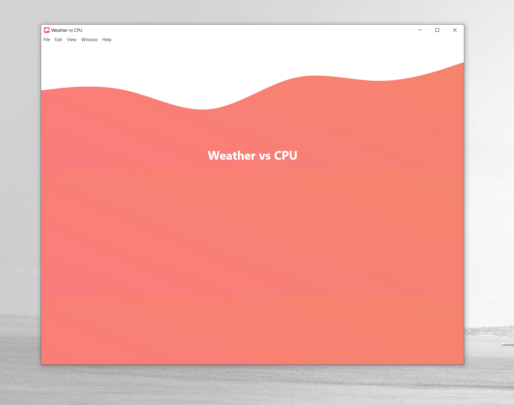

# Weather vs CPU <h1>

#### Electron, React crossplatform application, to detect how current, local weather influence my computer's core temperature and performance <h6>

- 
## Changes

Version 0.01
- [x] README boilerplate added
- [x] Basic project structure created
- [x] Initialised basic dependencies 
- [x] React with electron integrated
- [x] Added UI waves
- [x] Icon designed and added
- [x] Added application grid and some dummy data
* 
Version 0.02
- [x] Project structure optimised 
- [x] Added OpenWeatherMap API 
- [x] Implemented ability to pass Location data as props
- [x] Obtained API Keys, Stored and Secured
- [x] Added ability to read API from pc data

* 
Version 0.03
- [x] Project structure and size reduced
- [x] Added ability for frontend to communicate with backend 
- [x] Added Bat script to read temperature on Windows (need admin rights)
- [x] Added Custom Menu, submenu options
- [x] Added Shortcuts for menu items
- [x] Added Ability to package application for production
- [x] Added Openhardwaremonitor https://github.com/openhardwaremonitor/openhardwaremonitor

* 
Things to do
- [-] Obtain Admin rights for cpu temp fetching
- [-] Get process ID for Openhardwaremonitor termination on app close
- [-] CPU data for mac , linux
- [-] Add support for React dev tools
- [-] Get my location data, feed to API
- [-] Access OS Cpu data, (maybe with node.js or library)  
- [-] Optimise for different OS (process.platform darwin win32 linux)
- [-] Load and Display data side by side for (visual representation)
- [-] Analyse results (visual representation)

## Running instructions
* Copy project to your directory ( `git clone https://github.com/ibnzUK/weather-vs-cpu` )
* If you are Runing a Windows Subsystem for Linux (WSL), it is recommended to install project using PowerShel, GitBash or Command Prompt terminal (Concurrently dependency related) 
* Make sure to have Node.js Version >= 12.13.0. For Electron Forge 
* Install project packages (`npm install`)
* To Start electron application project (`npm run dev`)
* To Package up application for distribution (`npm run make`) 
* 

## For Testing
..
.
.

   

## 
