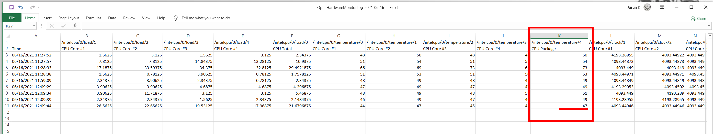

# Weather vs CPU <h1>


#### Electron, React application to display current, local weather and computers CPU temperature <h6>


- 
## Changes

Version 0.01
- [x] README boilerplate added
- [x] Basic project structure created
- [x] Initialised basic dependencies 
- [x] React with electron integrated
- [x] Added UI waves
- [x] Icon designed and added
- [x] Added application grid and some dummy data
* 
Version 0.02
- [x] Project structure optimised 
- [x] Added OpenWeatherMap API 
- [x] Implemented ability to pass Location data as props
- [x] Obtained API Keys, Stored and Secured
- [x] Added ability to read API from pc data

* 
Version 0.03
- [x] Project structure and size reduced
- [x] Added ability for front-end to communicate with backend 
- [x] Added Bat script to read the temperature on Windows (need admin rights)
- [x] Added Custom Menu, submenu options
- [x] Added Shortcuts for menu items
- [x] Added Ability to package the application for production
- [x] Added Openhardwaremonitor https://github.com/openhardwaremonitor/openhardwaremonitor
* 
Version 0.04
- [x] CPU Temperature Monitoring function added
- [x] Added Start and Stop auto-monitoring from the main menu
- [x] Added ability to stop monitoring from app
- [x] Add ability to identify and quit running processes 

* 
Things to do

- [-] Add ability to identify processors cores
- [-] Add ability to Change town or get location data (store in config)
- [-] Add support for React dev tools
- [-] Optimise for different OS (MacOS, Linux)
- [-] Collected data need to be pushed to db (or on users machine as app logs)
- [-] Load and Display collected data side by side for (visual representation)
- [-] Add Notifications for CPU Temperature Warnings, Errors


## Running instructions
* Copy project to your directory ( `git clone https://github.com/ibnzUK/weather-vs-cpu` )
* If you are Running a Windows Subsystem for Linux (WSL), it is recommended to install the project using PowerShell, GitBash or Command Prompt terminal (Concurrently dependency related) 
* Make sure to have Node.js Version >= 12.13.0. For Electron Forge 
* Install project packages (`npm install`)
* Get your API key from https://openweathermap.org/api
* create .env file in root directory and store your API key:
```
BROWSER=none
REACT_APP_API_KEY=Your_OpenWeatherMap_API_Key
``` 
* BROWSER=none option is for not opening the application in a browser window
* To Start electron application project (`npm run dev`)
* Default weather location is set to UK London, you can change it in `src/components/UI/Card.js ln:10  myTown = 'London'`
   
* To Package application for distribution (`npm run make`)  (NOTE: Make sure to rename application and lose '-' dash symbols, because of File Naming Conventions)

## Known Issues
* Not optimised for Mac or Linux OS (feel free to contribute)
* OpenHardwareMonitor software requires Administrator rights
* If CPU temperature is not displayed, check current date log file saved in `scripts/OpenHardwareMonitorLog-XXXX-XX-XX.csv` and get required column name for cpu temperature stats, for example column for 'CPU Package' has a name of  '/intelcpu/0/temperature/4' this value is than imported in `scripts/tempChecker.js ln:7  optionFromCSV = '/intelcpu/0/temperature/4';`

* If Log File is open, OpenHardwareMonitor software throws an error for not being able to update logs
* If OpenWeatherMap application is not killed after the process is stopped, change `scripts/stop.js ln:40  'TSKILL' to  'TASKKILL /PID' `
 
## Resources used 
   
* Open Weather Map API  - https://openweathermap.org/api
*  OpenHardwareMonitor (Windows) - https://github.com/openhardwaremonitor/openhardwaremonitor