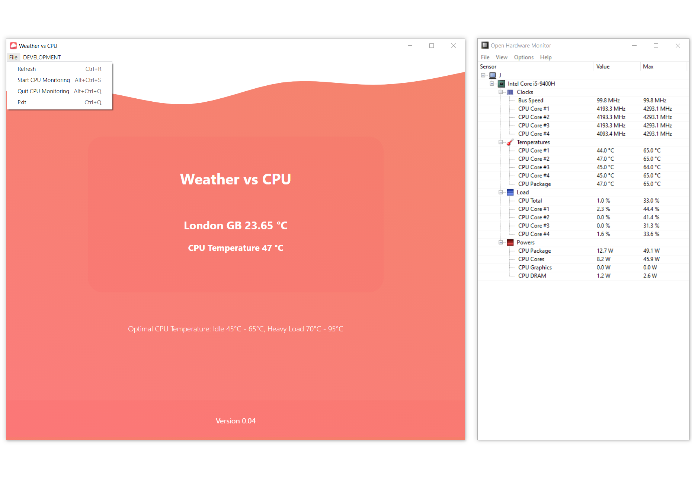

# Weather vs CPU <h1>

#### Electron, React crossplatform application, to detect how current, local weather influence my computer's core temperature and performance <h6>

- 
## Changes

- [x] README boilerplate added
- [x] Basic project structure created
- [x] Initialised basic dependencies 
- [x] React with electron integrated
- [x] Added UI waves
- [x] Icon designed and added
- [x] Added application grid and some dummy data
* 
- [x] Project structure optimised 
- [x] Added OpenWeatherMap API 
- [x] Implemented ability to pass Location data as props
- [x] API Keys stored and secured
- [x] Added ability to read CPU data

* 
- [-] Obtain API Keys, Store and Secure
- [-] CPU data for mac , linux
- [-] Fetch data from API for weather temperature  (axios?)
- [-] Fetch temp from API, (useEffect hook)
- [-] Get my location data, feed to API
- [-] Access OS Cpu data, (maybe with node.js or library)  
- [-] Optimise for different OS (process.platform darwin win32 linux)
- [-] Load and Display data side by side for (visual representation)
- [-] Analyse results (visual representation)

## Running instructions
* Copy project to your directory ( `git clone https://github.com/ibnzUK/weather-vs-cpu` )
* If you are Runing a Windows Subsystem for Linux (WSL), it is recommended to install project using PowerShel, GitBash or Command Prompt terminal 
* Install project packages (`npm install`)
* To Start electron application project (`npm run dev`)
* To Start development build on localhost http://localhost:3000  (`npm start`)

## For Testing
..
.
.

   

## 
